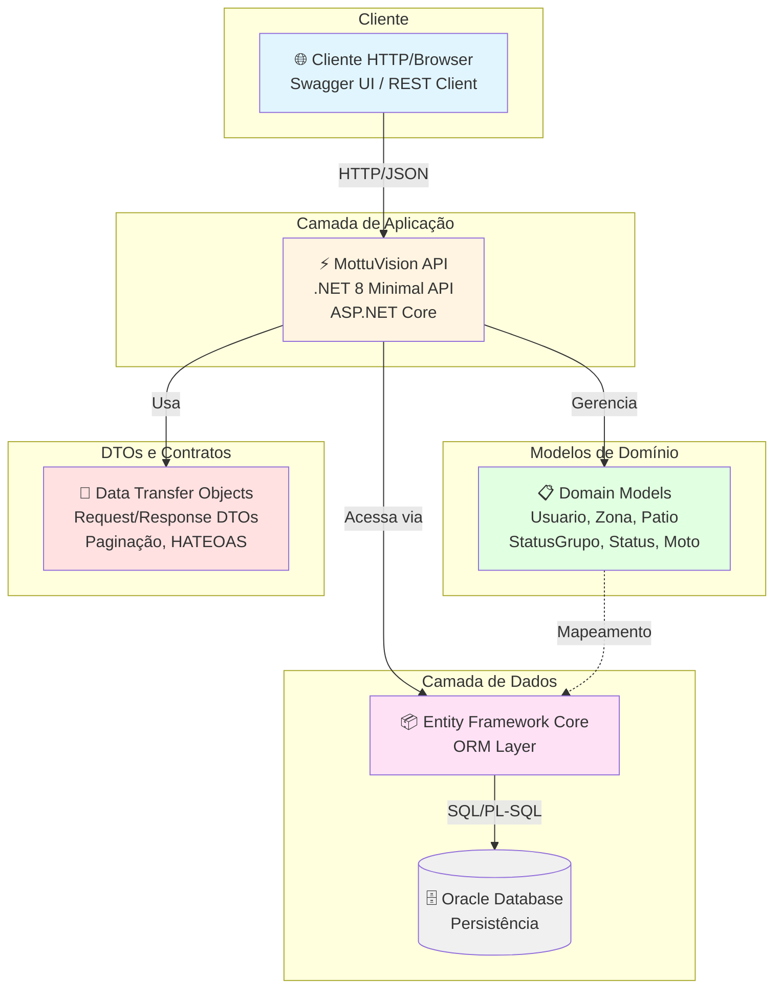
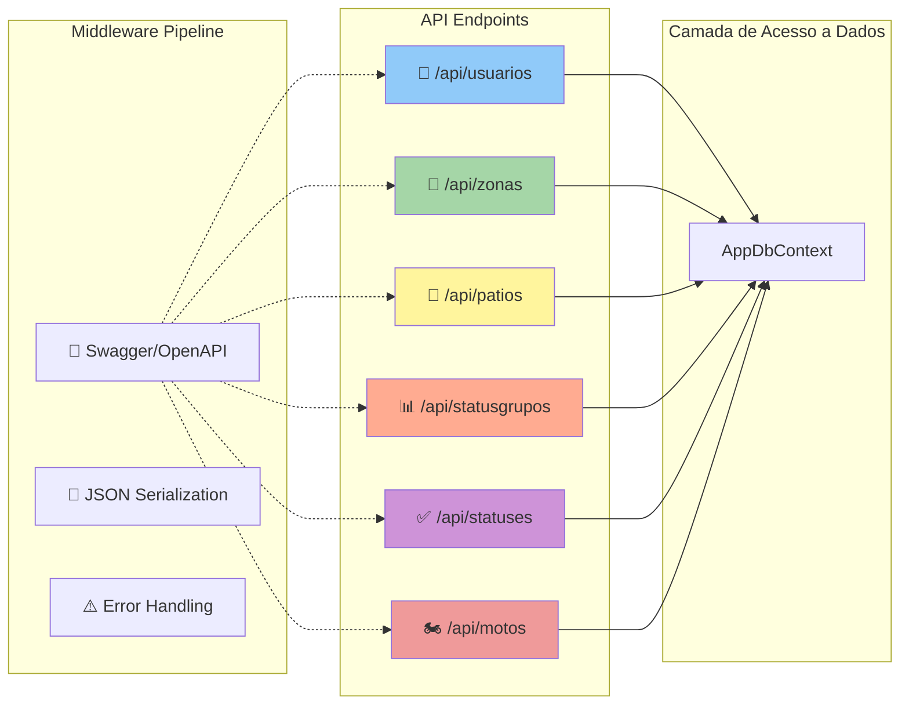
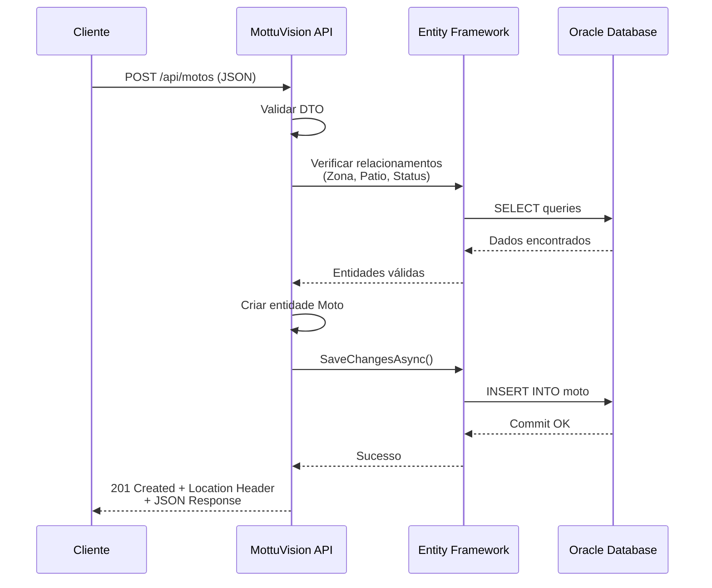

# MottuVision - API de Gerenciamento de Pátio

<div align="center">
  
  
  
  
  
</div>

## 👥 Integrantes do Grupo
- **Daniel da Silva Barros** | RM 556152
- **Luccas de Alencar Rufino** | RM 558253
- **Raul Clauson** - RM 555006

---

## 📋 Descrição do Projeto

O **MottuVision** é uma API RESTful desenvolvida para otimizar o gerenciamento de pátios de motocicletas da Mottu. A solução resolve problemas críticos de localização manual de veículos, reduzindo perdas operacionais e aumentando a produtividade em até 40%.

### 🎯 Problema Resolvido
A Mottu enfrentava desafios na localização manual de motocicletas em seus pátios, causando:
- Perdas de tempo na localização de veículos
- Erros de inventário
- Retrabalhos operacionais
- Baixa produtividade das equipes

### 💡 Solução Proposta
Sistema integrado que combina:
- **API REST robusta** para gerenciamento de entidades críticas
- **Controle de localização** por zonas e pátios
- **Rastreabilidade completa** de status e movimentações
- **Escalabilidade** para mais de 100 filiais

---

## 🏗️ Arquitetura do Sistema

### **Diagrama de Arquitetura (C4 - Nível de Contêiner)**



### **Diagrama de Componentes da API**



### **Fluxo de uma Requisição Típica**



---

## 🏗️ Justificativa da Arquitetura

### **Arquitetura Escolhida: Minimal API com Entity Framework Core**

**Por que esta arquitetura?**

1. **Minimal API (.NET 8)**
   - **Performance superior**: Menos overhead comparado ao MVC tradicional
   - **Simplicidade**: Ideal para APIs focadas em CRUD e operações diretas
   - **Modernidade**: Abordagem atual da Microsoft para APIs leves
   - **Produtividade**: Menos código boilerplate, mais foco na lógica de negócio

2. **Entity Framework Core com Oracle**
   - **Robustez empresarial**: Oracle Database para alta disponibilidade
   - **ORM maduro**: Abstração eficiente do banco de dados
   - **Migrations**: Versionamento automático do schema
   - **Performance**: Lazy loading e otimizações automáticas

3. **Padrão de Organização por Entidades**
   - **Escalabilidade**: Fácil adição de novas funcionalidades
   - **Manutenibilidade**: Código organizado por domínio
   - **Testabilidade**: Isolamento claro de responsabilidades

4. **REST + HATEOAS + Paginação**
   - **Padrões da indústria**: Seguindo melhores práticas REST
   - **Performance**: Paginação evita sobrecarga de dados
   - **Usabilidade**: HATEOAS facilita navegação na API

---

## 🎨 Melhorias Implementadas

### ✅ 1. Health Checks (10 pts)
Endpoint `/health` para monitoramento da saúde da API:
- ✅ Verifica conexão com banco de dados Oracle
- ✅ Retorna status detalhado (Healthy/Degraded/Unhealthy)
- ✅ Informações de duração dos checks
- ✅ Formato JSON estruturado

**Uso:**
```bash
GET /health
```

### ✅ 2. Versionamento da API (10 pts)
Implementação de versionamento seguindo boas práticas:
- ✅ Versão padrão: v1.0
- ✅ Suporte a múltiplas versões via URL
- ✅ Header `api-supported-versions` nas respostas
- ✅ Configuração extensível para futuras versões

### ✅ 3. Autenticação JWT (25 pts)
Segurança completa com JSON Web Tokens:
- ✅ Endpoint `/api/auth/login` para autenticação
- ✅ Geração de tokens JWT com expiração de 2 horas
- ✅ Middleware de autenticação/autorização
- ✅ Swagger integrado com botão "Authorize"
- ✅ Claims: Nome de usuário e ID
- ✅ Algoritmo: HS256

**Como usar:**
1. Faça login em `/api/auth/login`
2. Copie o token retornado
3. No Swagger, clique em "Authorize"
4. Cole o token e confirme
5. Agora você pode acessar endpoints protegidos

### ✅ 4. Machine Learning com ML.NET (25 pts)
Endpoint de previsão inteligente:
- ✅ **Modelo:** SDCA Regression
- ✅ **Objetivo:** Prever tempo de permanência da moto no pátio
- ✅ **Entrada:** ZonaId, PatioId, StatusId, DiaSemana (0-6)
- ✅ **Saída:** Tempo previsto em horas e dias + mensagem interpretativa
- ✅ Treinamento automático com dados sintéticos
- ✅ Endpoint `/api/ml/previsao-permanencia`

**Exemplo de previsão:**
```json
POST /api/ml/previsao-permanencia
{
  "zonaId": 1,
  "patioId": 1,
  "statusId": 1,
  "diaSemana": 1
}

Resposta:
{
  "tempoPrevistoHoras": 27.5,
  "tempoPrevistoDias": 2,
  "mensagem": "Moto deve permanecer de 2 a 3 dias",
  "dadosEntrada": { ... }
}
```

### ✅ 5. Diagrama de Arquitetura Completo
Adicionamos **3 diagramas Mermaid JS** ao README para facilitar o entendimento da arquitetura:

1. **Diagrama C4 (Nível de Contêiner)** - Visão de alto nível do sistema
2. **Diagrama de Componentes** - Estrutura dos endpoints e middleware
3. **Diagrama de Sequência** - Fluxo de requisição típica

### ✅ 6. Documentação Swagger com Boas Práticas HTTP
O Swagger foi completamente reformulado seguindo os padrões REST:

**Status Codes Corretos:**
- ✅ `200 OK` - GET e PUT bem-sucedidos
- ✅ `201 Created` - POST com Location header
- ✅ `204 No Content` - DELETE sem corpo de resposta
- ✅ `400 Bad Request` - Validações e erros de dados
- ✅ `401 Unauthorized` - Não autenticado
- ✅ `404 Not Found` - Recurso não encontrado
- ✅ `409 Conflict` - Conflitos de unicidade

**Verbos HTTP:**
- ✅ GET para leituras
- ✅ POST para criações
- ✅ PUT para atualizações completas
- ✅ DELETE para remoções

**Documentação Detalhada:**
- ✅ Descrição completa de cada endpoint
- ✅ Status codes documentados para sucesso e erro
- ✅ Validações explicadas
- ✅ Exemplos de requisição/resposta
- ✅ Integração JWT com botão Authorize

---

## 🗃️ Entidades Principais

O sistema gerencia **6 entidades principais** organizadas hierarquicamente:

### 1. **Usuario** 
Operadores e funcionários do sistema
- Controle de acesso e autenticação
- Rastreabilidade de ações

### 2. **StatusGrupo** 
Categorias de status (Ex: "Operacional", "Manutenção")
- Organização hierárquica de estados
- Flexibilidade para diferentes tipos de status

### 3. **Status** 
Estados específicos das motocicletas (Ex: "Disponível", "Em Reparo")
- Controle granular do estado dos veículos
- Relacionamento com grupos para organização

### 4. **Zona** 
Divisões do pátio (Ex: "Zona A", "Zona B")
- Organização física do espaço
- Facilitação da localização

### 5. **Patio** 
Locais físicos onde ficam as motos
- Gestão de múltiplas unidades
- Controle de capacidade

### 6. **Moto** *(Entidade Central)*
Informações completas das motocicletas
- Dados técnicos (placa, chassi)
- Localização atual (zona + pátio)
- Estado operacional (status)
- Histórico e observações

**Justificativa do Domínio:** O gerenciamento de frotas de motocicletas é um problema real da Mottu, empresa líder em aluguel de motos para entregadores. A digitalização deste processo gera valor mensurável através da redução de tempo de localização e aumento da produtividade operacional.

---

## ⚙️ Tecnologias Utilizadas

- **.NET 8.0** - Framework principal
- **ASP.NET Core Minimal API** - API Web moderna e performática
- **Entity Framework Core 8.0** - ORM para acesso a dados
- **Oracle Database** - Banco de dados empresarial
- **Swagger/OpenAPI** - Documentação interativa da API
- **JWT (JSON Web Tokens)** - Autenticação e segurança
- **ML.NET** - Machine Learning integrado
- **Health Checks** - Monitoramento de saúde da API
- **API Versioning** - Versionamento de endpoints
- **C# 12** - Linguagem de programação

### Pacotes NuGet:
```xml
<!-- Core -->
<PackageReference Include="Microsoft.EntityFrameworkCore" Version="8.0.8" />
<PackageReference Include="Microsoft.EntityFrameworkCore.Design" Version="8.0.8" />
<PackageReference Include="Oracle.EntityFrameworkCore" Version="8.21.121" />
<PackageReference Include="Oracle.ManagedDataAccess.Core" Version="3.21.130" />

<!-- Documentação -->
<PackageReference Include="Swashbuckle.AspNetCore" Version="6.6.2" />
<PackageReference Include="Swashbuckle.AspNetCore.Annotations" Version="6.6.2" />

<!-- Segurança -->
<PackageReference Include="BCrypt.Net-Next" Version="4.0.3" />
<PackageReference Include="Microsoft.AspNetCore.Authentication.JwtBearer" Version="8.0.8" />
<PackageReference Include="System.IdentityModel.Tokens.Jwt" Version="8.0.2" />

<!-- Health Checks -->
<PackageReference Include="Microsoft.Extensions.Diagnostics.HealthChecks.EntityFrameworkCore" Version="8.0.8" />

<!-- API Versioning -->
<PackageReference Include="Asp.Versioning.Http" Version="8.1.0" />
<PackageReference Include="Asp.Versioning.Mvc.ApiExplorer" Version="8.1.0" />

<!-- Machine Learning -->
<PackageReference Include="Microsoft.ML" Version="3.0.1" />
```

---

## 🚀 Instruções de Execução

### ⚠️ **IMPORTANTE: Configuração do Banco de Dados**

**1. Configure suas credenciais Oracle no `appsettings.json`:**
```json
{
  "ConnectionStrings": {
    "OracleConnection": "User Id=SEU_USUARIO;Password=SUA_SENHA;Data Source=(DESCRIPTION=(ADDRESS=(PROTOCOL=TCP)(HOST=oracle.fiap.com.br)(PORT=1521))(CONNECT_DATA=(SERVICE_NAME=orcl)));"
  }
}
```

### **Execução Completa (Recomendado):**

```bash
# 1. Clone o repositório
git clone [URL_DO_REPOSITORIO]
cd MottuVisionV1

# 2. Restaurar dependências
dotnet restore

# 3. Limpar projeto
dotnet clean

# 4. Build do projeto
dotnet build

# 5. Resetar banco (recriar schema)
dotnet ef database drop --force
dotnet ef migrations remove
dotnet ef migrations add InitialCreate
dotnet ef database update

# 6. Executar aplicação
dotnet run
```

### **Execução Rápida:**
```bash
dotnet run
```

### **Acesso à API:**
- **URL Base:** `http://localhost:5111`

---

## 📚 Endpoints da API

### **Resumo dos Recursos Disponíveis:**

| Categoria | Endpoint | Funcionalidades |
|-----------|----------|----------------|
| **🏥 Health** | `/health` | Monitoramento de saúde da API e banco de dados |
| **🔐 Autenticação** | `/api/auth/login` | Login com JWT (25 pts) |
| **🤖 Machine Learning** | `/api/ml/previsao-permanencia` | Previsão de tempo de permanência (25 pts) |
| **👤 Usuários** | `/api/usuarios` | CRUD completo, validação de usuário único |
| **📍 Zonas** | `/api/zonas` | CRUD completo, organização por letra |
| **🏢 Pátios** | `/api/patios` | CRUD completo, validação de dependências |
| **📊 StatusGrupos** | `/api/statusgrupos` | CRUD completo, hierarquia de status |
| **✅ Status** | `/api/statuses` | CRUD completo, relacionamento com grupos |
| **🏍️ Motos** | `/api/motos` | CRUD completo, filtros, validações |

### **Padrões Implementados:**
- ✅ **Paginação**: `?page=1&pageSize=20` em todas as listagens
- ✅ **HATEOAS**: Links de navegação em respostas paginadas  
- ✅ **Filtros**: Busca por placa nas motos
- ✅ **Validações**: Integridade referencial e unicidade
- ✅ **Status Codes**: 200, 201, 204, 400, 401, 404 adequadamente utilizados
- ✅ **JWT**: Autenticação Bearer token (10 pts)
- ✅ **Health Checks**: Endpoint de monitoramento (10 pts)
- ✅ **Versionamento**: Suporte a múltiplas versões da API (10 pts)

---

## 🧪 Exemplos de Uso dos Endpoints

### **Novos Endpoints Implementados:**

#### **1. Health Check**
```bash
GET /health

# Resposta: 200 OK
{
  "status": "Healthy",
  "checks": [
    {
      "name": "database",
      "status": "Healthy",
      "description": null,
      "duration": 45.2
    }
  ],
  "totalDuration": 50.5
}
```

#### **2. Login com JWT**
```bash
POST /api/auth/login
Content-Type: application/json

{
  "usuario": "admin",
  "senha": "admin@123"
}

# Resposta: 200 OK
{
  "token": "eyJhbGciOiJIUzI1NiIsInR5cCI6IkpXVCJ9...",
  "usuario": "admin",
  "expiresAt": "2024-11-20T23:30:00Z"
}

# Para usar o token:
# No Swagger: Clique em "Authorize" e cole o token
# Ou no header: Authorization: Bearer {token}
```

#### **3. Previsão ML.NET - Tempo de Permanência**
```bash
POST /api/ml/previsao-permanencia
Content-Type: application/json

{
  "zonaId": 1,
  "patioId": 1,
  "statusId": 1,
  "diaSemana": 1
}

# Resposta: 200 OK
{
  "tempoPrevistoHoras": 27.5,
  "tempoPrevistoDias": 2,
  "mensagem": "Moto deve permanecer de 2 a 3 dias",
  "dadosEntrada": {
    "zonaId": 1,
    "patioId": 1,
    "statusId": 1,
    "diaSemana": 1
  }
}
```

---

### **Endpoints CRUD Existentes:**

#### **4. Criar Status Grupo**
```bash
POST /api/statusgrupos
Content-Type: application/json

{
  "nome": "Operacional"
}

# Resposta: 201 Created
{
  "id": 1,
  "nome": "Operacional"
}
```

### **2. Criar Status**
```bash
POST /api/statuses
Content-Type: application/json

{
  "nome": "Disponível",
  "statusGrupoId": 1
}

# Resposta: 201 Created
{
  "id": 1,
  "nome": "Disponível",
  "statusGrupoId": 1
}
```

### **3. Criar Zona**
```bash
POST /api/zonas
Content-Type: application/json

{
  "nome": "Zona Norte",
  "letra": "N"
}

# Resposta: 201 Created
{
  "id": 1,
  "nome": "Zona Norte",
  "letra": "N"
}
```

### **4. Criar Pátio**
```bash
POST /api/patios
Content-Type: application/json

{
  "nome": "Pátio Central SP"
}

# Resposta: 201 Created
{
  "id": 1,
  "nome": "Pátio Central SP"
}
```

### **5. Criar Moto**
```bash
POST /api/motos
Content-Type: application/json

{
  "placa": "ABC1D23",
  "chassi": "9BWZZZ377VT004251",
  "qrCode": "QR001",
  "dataEntrada": "2024-11-20T10:30:00",
  "previsaoEntrega": "2024-11-25T18:00:00",
  "fotos": "foto1.jpg,foto2.jpg",
  "zonaId": 1,
  "patioId": 1,
  "statusId": 1,
  "observacoes": "Moto em perfeito estado"
}

# Resposta: 201 Created
{
  "id": 1,
  "placa": "ABC1D23",
  "chassi": "9BWZZZ377VT004251",
  "qrCode": "QR001",
  "dataEntrada": "2024-11-20T10:30:00",
  "zonaId": 1,
  "patioId": 1,
  "statusId": 1
}
```

### **6. Listar Motos com Paginação e Filtro**
```bash
GET /api/motos?page=1&pageSize=10&placa=ABC

# Resposta: 200 OK
{
  "items": [
    {
      "id": 1,
      "placa": "ABC1D23",
      "chassi": "9BWZZZ377VT004251",
      "zona": {
        "id": 1,
        "nome": "Zona Norte",
        "letra": "N"
      },
      "patio": {
        "id": 1,
        "nome": "Pátio Central SP"
      },
      "status": {
        "id": 1,
        "nome": "Disponível"
      }
    }
  ],
  "page": 1,
  "pageSize": 10,
  "totalCount": 1,
  "links": [
    {
      "rel": "self",
      "href": "https://localhost/api/motos?page=1&pageSize=10",
      "method": "GET"
    }
  ]
}
```

### **7. Buscar Moto por ID com Relacionamentos**
```bash
GET /api/motos/1

# Resposta: 200 OK
{
  "id": 1,
  "placa": "ABC1D23",
  "chassi": "9BWZZZ377VT004251",
  "qrCode": "QR001",
  "dataEntrada": "2024-11-20T10:30:00",
  "zona": {
    "id": 1,
    "nome": "Zona Norte",
    "letra": "N"
  },
  "patio": {
    "id": 1,
    "nome": "Pátio Central SP"
  },
  "status": {
    "id": 1,
    "nome": "Disponível",
    "statusGrupo": {
      "id": 1,
      "nome": "Operacional"
    }
  }
}
```

### **8. Atualizar Moto**
```bash
PUT /api/motos/1
Content-Type: application/json

{
  "placa": "ABC1D23",
  "chassi": "9BWZZZ377VT004251",
  "qrCode": "QR001-UPDATED",
  "dataEntrada": "2024-11-20T10:30:00",
  "zonaId": 2,
  "patioId": 1,
  "statusId": 2,
  "observacoes": "Moto transferida para Zona Sul"
}

# Resposta: 200 OK
```

### **9. Remover Moto**
```bash
DELETE /api/motos/1

# Resposta: 204 No Content
```

## 📖 Documentação Swagger

A API possui documentação completa via Swagger/OpenAPI seguindo as **melhores práticas REST e HTTP**:

### ✅ Boas Práticas Implementadas

**Verbos HTTP Corretos:**
- `GET` - Recuperar recursos (listagens e detalhes)
- `POST` - Criar novos recursos
- `PUT` - Atualizar recursos existentes
- `DELETE` - Remover recursos

**Status Codes Adequados:**
| Code | Uso na API |
|------|------------|
| **200 OK** | Sucesso em GET e PUT |
| **201 Created** | Recurso criado (POST) + Location header |
| **204 No Content** | Sucesso em DELETE (sem corpo) |
| **400 Bad Request** | Dados inválidos, validações falharam |
| **404 Not Found** | Recurso não encontrado |
| **409 Conflict** | Conflito (duplicação de dados únicos) |

**Recursos da Documentação:**
- ✅ **Descrições detalhadas** de todos os endpoints com exemplos de uso
- ✅ **Status codes documentados** para cada operação (sucesso e erro)
- ✅ **Parâmetros documentados** com tipos, validações e valores padrão
- ✅ **Exemplos de payloads** para requisições e respostas
- ✅ **Modelos de dados** completamente descritos com DTOs
- ✅ **Validações explicadas** (unicidade, integridade referencial)
- ✅ **HATEOAS** - Links de navegação em respostas paginadas
- ✅ **Agrupamento por entidades** para melhor navegação

**Acesso ao Swagger:**
```
http://localhost:5111/swagger
```

---

## 🔧 Pré-requisitos

- **.NET 8.0 SDK** - [Download aqui](https://dotnet.microsoft.com/download/dotnet/8.0)
- **Acesso ao Oracle Database** (oracle.fiap.com.br)
- **Credenciais válidas** do Oracle FIAP
- **JetBrains Rider** ou **Visual Studio** (opcional)

---

## 🎯 Benefícios da Solução

### **Operacionais:**
- 📈 **40% de aumento** na produtividade operacional
- ⏱️ **Localização em segundos** em vez de minutos
- 📉 **Redução de perdas** e erros de inventário  
- 🔍 **Rastreabilidade completa** de todas as operações
- 🏢 **Escalabilidade** para mais de 100 filiais
- 🛡️ **Auditoria** e controle de alterações

### **Técnicos:**
- 🔐 **Segurança robusta** com JWT (autenticação e autorização)
- 🏥 **Monitoramento proativo** com Health Checks
- 🤖 **Inteligência artificial** para previsões com ML.NET
- 📦 **API versionada** para evolução sem breaking changes
- 📊 **Documentação completa** com Swagger/OpenAPI
- ✅ **Boas práticas REST** em todos os endpoints

### **De Negócio:**
- 💰 **Redução de custos** operacionais
- ⚡ **Tomada de decisão** baseada em dados (ML)
- 📈 **Previsibilidade** de permanência de veículos
- 🔄 **Integração fácil** com outros sistemas via API
- 🛠️ **Manutenção simplificada** com código limpo e documentado

---

## Desenvolvido com 💻 e ♥️

- **Daniel Barros** - RM 556152
- **Luccas Rufino** - RM 558253
- **Raul Clauson** - RM 555006
